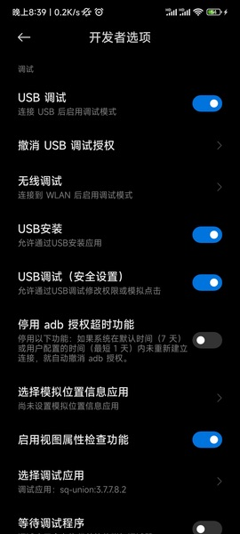

# 目录

* [Logcat 入口配置](#logcat-入口配置)

* [Logcat Activity 方向配置](#logcat-activity-方向配置)

* [设置 Logcat 显示的日志颜色](#设置-logcat-显示的日志颜色)

* [设置 Logcat 默认筛选条件](#设置-logcat-默认筛选条件)

* [设置 Logcat 日志过滤规则](#设置-logcat-日志过滤规则)

* [设置显示所有应用打印的日志](#设置显示所有应用打印的日志)

* [我如果要在线上使用这个库该怎么办](#我如果要在线上使用这个库该怎么办)

* [在多进程情况下无法展示入口怎么办](#在多进程情况下无法展示入口怎么办)

#### Logcat 入口配置

* 框架默认提供了两种入口

    * 通知栏入口

    * 悬浮窗入口

* 入口默认的规则：在有通知栏权限的情况下，会优先使用通知栏入口，否则则会显示悬浮窗入口

* 如何修改默认的规则？可在清单文件中加入以下配置即可

```xml
<manifest>

    <application>

        <!-- 悬浮窗入口 -->
        <meta-data
            android:name="LogcatWindowEntrance"
            android:value="false" />

        <!-- 通知栏入口 -->
        <meta-data
            android:name="LogcatNotifyEntrance"
            android:value="true" />

    </application>

</manifest>
```

#### Logcat Activity 方向配置

* `LogcatActivity` 默认是跟随手机屏幕方向的，如果你需要固定竖屏方向，那么需要在你的清单文件中加入此配置：

```xml
<activity
    android:name="com.hjq.logcat.LogcatActivity"
    android:configChanges="orientation|screenSize|keyboardHidden"
    android:launchMode="singleInstance"
    android:screenOrientation="portrait"
    android:theme="@style/Theme.AppCompat.Light.NoActionBar"
    tools:node="replace" />
```

#### 设置 Logcat 显示的日志颜色

* 在项目的 `values/color.xml` 中加入你喜欢的配色，例如：

```xml
<color name="logcat_level_verbose_color">#FFBBBBBB</color>
<color name="logcat_level_debug_color">#FF33B5E5</color>
<color name="logcat_level_info_color">#FF99CC00</color>
<color name="logcat_level_warn_color">#FFFFBB33</color>
<color name="logcat_level_error_color">#FFFF4444</color>
<color name="logcat_level_other_color">#FFFFFFFF</color>
```

#### 设置 Logcat 默认筛选条件

* 如果要修改框架默认筛选条件，只需在清单文件中加入以下配置即可

```xml
<manifest>

    <application>

        <!-- 默认搜索关键字 -->
        <meta-data
            android:name="LogcatDefaultSearchKey"
            android:value="MainActivity" />

        <!-- 默认日志等级 -->
        <meta-data
            android:name="LogcatDefaultLogLevel"
            android:value="E" />

    </application>

</manifest>
```

#### 设置 Logcat 日志过滤规则

* 在项目的 `values/string.xml` 中加入你要过滤的日志 TAG，例如：

```xml
<string-array name="logcat_filter_list" tools:ignore="ExtraTranslation">
    <item>ActivityThread</item>
    <item>InputMethodManager</item>
    <item>OpenGLRenderer</item>
    <item>VideoCapabilities</item>
    <item>ViewRootImpl</item>
    <item>Settings</item>
    <item>Looper</item>
    <item>TextView</item>
    <item>TypefaceUtils</item>
    <item>MultiDex</item>
    <item>AudioManager</item>
    <item>ConnectivityManager</item>
    <item>NetworkSecurityConfig</item>
    <item>HwPolicyFactory:</item>
    <item>HwWidgetFactory:</item>
    <item>HwApiCacheMangerEx</item>
    <item>HwWechatOptimizeImpl</item>
    <item>HwSplineOverScrollerExImpl</item>
    <item>HwAppInnerBoostImpl</item>
    <item>HwCustConnectivityManagerImpl</item>
    <item>HwApsImpl</item>
    <item>HwPhoneWindow</item>
    <item>HwAutofillHelper</item>
    <item>hwbr_engine_mainprocess</item>
    <item>hwbr_engine_hwbr_event</item>
    <item>hwbr_engine_PathUtils</item>
    <item>hwbr_engine_AwContents</item>
    <item>hwbr_engine_cr_IMM</item>
    <item>hwbr_engine_LibraryLoader</item>
    <item>hwbr_engine_BrowserStartup</item>
    <item>hwbr_engine_cr_WebContentsImpl</item>
    <item>CrashReport</item>
    <item>CrashReportInfo</item>
    <item>CrashReport-Native</item>
    <item>LeakCanary</item>
    <item>Timeline</item>
    <item>AssistStructure</item>
    <item>EgretLoader</item>
    <item>OverScrollerOptimization</item>
    <item>HiTouch_PressGestureDetector</item>
    <item>HiTouch_HiTouchSensor</item>
    <item>FLTAG_SFM</item>
    <item>FLTAG_FM</item>
    <item>libEGL</item>
    <item>AwareLog</item>
    <item>AwareBitmapCacher</item>
    <item>AwareAppScheduleManager</item>
    <item>FeatureFactory</item>
    <item>WebViewFactory</item>
    <item>ConfigStore</item>
    <item>mali_winsys</item>
    <item>ZrHung.AppEyeUiProbe</item>
    <item>chatty</item>
    <item>stylus</item>
    <item>libc</item>
    <item>chromium</item>
    <item>Perf</item>
    <item>FeatureParser</item>
    <item>Binder:intercep</item>
    <item>cr_LibraryLoader</item>
    <item>cr_BrowserStartup</item>
    <item>DecorView</item>
    <item>DecorView[]</item>
    <item>ForceDarkHelper</item>
    <item>skia</item>
    <item>AdrenoGLES-0</item>
    <item>ViewContentFactory</item>
    <item>MiuiFrameworkFactory</item>
    <item>MIUIInput</item>
    <item>cr_media</item>
    <item>cr_CachingUmaRecorder</item>
    <item>TetheringManager</item>
    <item>MiuiFreeDragHelper</item>
    <item>MiuiFreeDragImpl</item>
    <item>ContentProviderMonitor</item>
    <item>ContentCatcher</item>
    <item>ApplicationLoaders</item>
    <item>RenderInspector</item>
</string-array>
```

#### 设置显示所有应用打印的日志

* 首先有一点，App 本身是无法获取其他 App 日志的

* 如果你有这个需要，也不是不能实现，在电脑端输入以下 adb 命令

```text
// 给指定的应用授予读取 Log 的权限，com.hjq.logcat.demo 需要改成你的包名
adb shell pm grant com.hjq.logcat.demo android.permission.READ_LOGS
```

* 重启应用即可生效（有的手机会自动杀死进程），授权过后除非应用被卸载，否则不会消失

* 如果执行上面的命令失败了，并且提示以下信息
  
```text
Exception occurred while executing 'grant':
java.lang.SecurityException: grantRuntimePermission: 
    Neither user 2000 nor current process has android.permission.GRANT_RUNTIME_PERMISSIONS.
```

* 则需要前往开发者选项中开启 `USB 调试（安全）` 的设置选项



* 开启之后，如果还是一样的提示，证明没有生效，可以尝试以下操作

   * 等待 5 分钟

   * 重新拔插一下手机

   * 检查 `USB 安装` 选项有没有开启

   * 重新打开 `USB 调试（安全）`选项

   * 重启一下 cmd 命令行终端

   * 重启一下手机再试

   * 换一台手机再试

* 作者建议如果没有这个需求，则不需要开启此项功能，因为这样会导致 Logcat 显示的日志变多，会增加日志的复杂度和查找的难度

#### 我如果要在线上使用这个库该怎么办

* 首先我是十分不推荐在线上使用这个库，因为这个库的定位是为了方便调试使用，我也不敢保证这个库在线上使用会有什么问题，当然你如果要一定这样做，也不是没有办法，具体步骤如下：

* 第一步：将依赖方式从 `debugImplementation` 修改成 `implementation`

```groovy
dependencies {
    debugImplementation 'com.github.getActivity:Logcat:x.x'
}
```

```groovy
dependencies {
    implementation 'com.github.getActivity:Logcat:x.x'
}
```

* 第二步：隐藏 Logcat 入口展示

```xml
<manifest>

    <application>

        <!-- 悬浮窗入口 -->
        <meta-data
            android:name="LogcatWindowEntrance"
            android:value="false" />

        <!-- 通知栏入口 -->
        <meta-data
            android:name="LogcatNotifyEntrance"
            android:value="false" />

    </application>

</manifest>
```

* 第三步：在合适的时机调起 Logcat

```java
try {
    Class<?> clazz = Class.forName("com.hjq.logcat.LogcatActivity");
    startActivity(new Intent(this, clazz));
} catch (ClassNotFoundException e) {
    e.printStackTrace();
}
```

#### 在多进程情况下无法展示入口怎么办

* 这个问题其实之前就有人提出过 [Logcat/issues/35](https://github.com/getActivity/Logcat/issues/35)，但是经过核实是无法修复的，这是因为在开启子进程的情况下，会二次创建 Application 对象，然后重新走一遍 onCreate 方法，但是 ContentProvider 组件就不一样了，并不会重复创建，这就导致一个问题，Logcat 这个框架本身就依赖 ContentProvider 作为框架的初始化入口，但是它在子进程并不会被系统二次创建，更别说调用了，这个属于硬伤。

* 当然不代表这就没有解决手段，你可以手动初始化 Logcat 框架来解决这一问题，具体方式如下：

* 第一步：先在清单文件中去除 Logcat 框架初始化入口

```xml
<?xml version="1.0" encoding="utf-8"?>
<manifest xmlns:android="http://schemas.android.com/apk/res/android"
    xmlns:tools="http://schemas.android.com/tools"
    package="com.xxx.xxx">

    <application>

        <provider
            android:name="com.hjq.logcat.LogcatProvider"
            tools:node="remove" />

    </application>

</manifest>
```

* 第二步：在 Application.onCreate 方法中手动初始化 Logcat 框架

```java
public final class XxxApplication extends Application {

   @Override
   public void onCreate() {
      super.onCreate();

       try {
           Class<?> logcatProviderClass = Class.forName("com.hjq.logcat.LogcatProvider");
           Object logcatProvider = logcatProviderClass.newInstance();
           Method attachInfoMethod = logcatProviderClass.getMethod("attachInfo", Context.class, ProviderInfo.class);
           attachInfoMethod.setAccessible(true);
           attachInfoMethod.invoke(logcatProvider, this, null);
       } catch (Exception e) {
           e.printStackTrace();
       }
   }
}
```