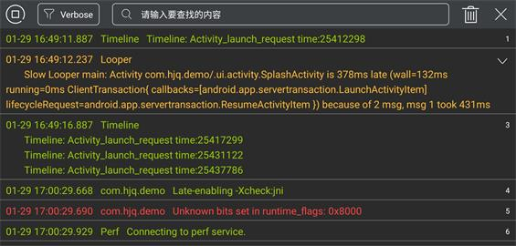
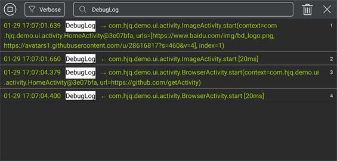
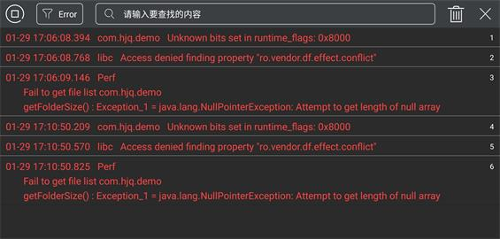
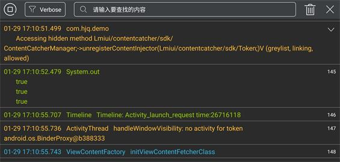
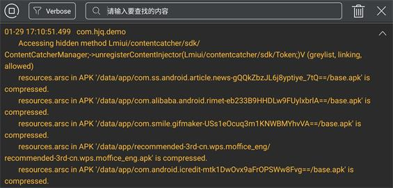
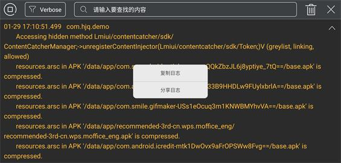

# 日志调试框架

> [点击此处下载Demo](https://raw.githubusercontent.com/getActivity/Logcat/master/Logcat.apk)


#### 集成步骤

    dependencies {
        debugImplementation 'com.hjq:logcat:3.0'
    }

#### 截图欣赏













#### 框架亮点

* 支持日志捕捉开关功能

* 支持日志内容拼接功能

* 支持日志内容收缩展开

* 支持日志复制分享功能

* 支持日志搜索文本高亮

#### 作者的其他开源项目

* 架构工程：[AndroidProject](https://github.com/getActivity/AndroidProject)

* 网络框架：[EasyHttp](https://github.com/getActivity/EasyHttp)

* 权限框架：[XXPermissions](https://github.com/getActivity/XXPermissions)

* 吐司框架：[ToastUtils](https://github.com/getActivity/ToastUtils)

* 标题栏框架：[TitleBar](https://github.com/getActivity/TitleBar)

* 国际化框架：[MultiLanguages](https://github.com/getActivity/MultiLanguages)

* 悬浮窗框架：[XToast](https://github.com/getActivity/XToast)

#### Android技术讨论Q群：78797078

#### 如果您觉得我的开源库帮你节省了大量的开发时间，请扫描下方的二维码随意打赏，要是能打赏个 10.24 :monkey_face:就太:thumbsup:了。您的支持将鼓励我继续创作:octocat:

 

#### [点击查看捐赠列表](https://github.com/getActivity/Donate)

## License

```text
Copyright 2020 Huang JinQun

Licensed under the Apache License, Version 2.0 (the "License");
you may not use this file except in compliance with the License.
You may obtain a copy of the License at

   http://www.apache.org/licenses/LICENSE-2.0

Unless required by applicable law or agreed to in writing, software
distributed under the License is distributed on an "AS IS" BASIS,
WITHOUT WARRANTIES OR CONDITIONS OF ANY KIND, either express or implied.
See the License for the specific language governing permissions and
limitations under the License.
```