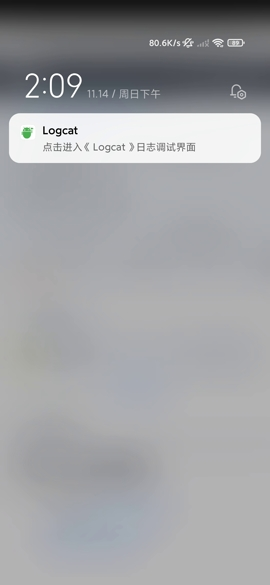
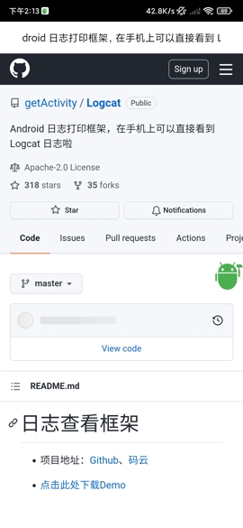
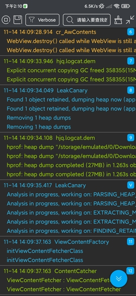
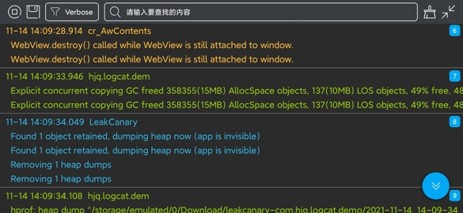

# 日志查看框架


* 项目地址：[Github](https://github.com/getActivity/Logcat)、[码云](https://gitee.com/getActivity/Logcat)

* 可以扫码下载 Demo 进行演示或者测试，如果扫码下载不了的，[点击此处可直接下载](https://github.com/getActivity/Logcat/releases/download/10.3/Logcat.apk)


  




<video src="picture/video_demo.mp4" width="585px" height="270px" controls="" muted="" autoplay="" loop=""></video>

#### 集成步骤

* 如果你的项目 Gradle 配置是在 `7.0 以下`，需要在 `build.gradle` 文件中加入

```groovy
allprojects {
    repositories {
        // JitPack 远程仓库：https://jitpack.io
        maven { url 'https://jitpack.io' }
    }
}
```

* 如果你的 Gradle 配置是 `7.0 及以上`，则需要在 `settings.gradle` 文件中加入

```groovy
dependencyResolutionManagement {
    repositories {
        // JitPack 远程仓库：https://jitpack.io
        maven { url 'https://jitpack.io' }
    }
}
```

* 配置完远程仓库后，在项目 app 模块下的 `build.gradle` 文件中加入远程依赖

```groovy
dependencies {
    // 日志调试框架：https://github.com/getActivity/Logcat
    debugImplementation 'com.github.getActivity:Logcat:10.3'
}
```

#### AndroidX

* 如果项目是基于 **AndroidX** 包，请在项目 `gradle.properties` 文件中加入

```text
# 表示将第三方库迁移到 AndroidX
android.enableJetifier = true
```

* 如果项目是基于 **Support** 包则不需要加入此配置

#### 使用方式

* 无需调用，直接运行，然后授予悬浮窗权限即可

* 在 debug 模式下运行即可，在 release 正式打包的时不会集成本库，尽管放心

#### 入口配置

* 框架默认提供了两种入口

    * 通知栏入口

    * 悬浮窗入口

* 入口默认的规则：在有通知栏权限的情况下，会优先使用通知栏入口，否则则会显示悬浮窗入口

* 如何修改默认的规则？可在清单文件中加入以下配置即可

```xml
<manifest>

    <application>

        <!-- 悬浮窗入口 -->
        <meta-data
            android:name="LogcatWindowEntrance"
            android:value="false" />

        <!-- 通知栏入口 -->
        <meta-data
            android:name="LogcatNotifyEntrance"
            android:value="true" />

    </application>

</manifest>
```

#### 方向配置

* `LogcatActivity` 默认是跟随手机屏幕方向的，如果你需要固定竖屏方向，那么需要在你的清单文件中加入此配置：

```xml
<activity
    android:name="com.hjq.logcat.LogcatActivity"
    android:configChanges="orientation|screenSize|keyboardHidden"
    android:launchMode="singleInstance"
    android:screenOrientation="portrait"
    android:theme="@style/Theme.AppCompat.Light.NoActionBar"
    android:windowSoftInputMode="stateHidden"
    tools:node="replace" />
```

#### 日志颜色个性化

* 在项目的 `values/color.xml` 中加入你喜欢的配色，例如：

```xml
<color name="logcat_level_verbose_color">#FFBBBBBB</color>
<color name="logcat_level_debug_color">#FF33B5E5</color>
<color name="logcat_level_info_color">#FF99CC00</color>
<color name="logcat_level_warn_color">#FFFFBB33</color>
<color name="logcat_level_error_color">#FFFF4444</color>
<color name="logcat_level_other_color">#FFFFFFFF</color>
```

#### 过滤日志

* 在项目的 `values/string.xml` 中加入你要过滤的日志 TAG，例如：

```xml
<string-array name="logcat_filter_list" tools:ignore="ExtraTranslation">
    <item>ActivityThread</item>
    <item>InputMethodManager</item>
    <item>OpenGLRenderer</item>
    <item>VideoCapabilities</item>
    <item>ViewRootImpl</item>
    <item>Settings</item>
    <item>Looper</item>
    <item>TextView</item>
    <item>TypefaceUtils</item>
    <item>MultiDex</item>
    <item>AudioManager</item>
    <item>ConnectivityManager</item>
    <item>NetworkSecurityConfig</item>
    <item>HwPolicyFactory:</item>
    <item>HwWidgetFactory:</item>
    <item>HwApiCacheMangerEx</item>
    <item>HwWechatOptimizeImpl</item>
    <item>HwSplineOverScrollerExImpl</item>
    <item>HwAppInnerBoostImpl</item>
    <item>HwCustConnectivityManagerImpl</item>
    <item>HwApsImpl</item>
    <item>HwPhoneWindow</item>
    <item>HwAutofillHelper</item>
    <item>hwbr_engine_mainprocess</item>
    <item>hwbr_engine_hwbr_event</item>
    <item>hwbr_engine_PathUtils</item>
    <item>hwbr_engine_AwContents</item>
    <item>hwbr_engine_cr_IMM</item>
    <item>hwbr_engine_LibraryLoader</item>
    <item>hwbr_engine_BrowserStartup</item>
    <item>hwbr_engine_cr_WebContentsImpl</item>
    <item>CrashReport</item>
    <item>CrashReportInfo</item>
    <item>CrashReport-Native</item>
    <item>LeakCanary</item>
    <item>Timeline</item>
    <item>AssistStructure</item>
    <item>EgretLoader</item>
    <item>OverScrollerOptimization</item>
    <item>HiTouch_PressGestureDetector</item>
    <item>HiTouch_HiTouchSensor</item>
    <item>FLTAG_SFM</item>
    <item>FLTAG_FM</item>
    <item>libEGL</item>
    <item>AwareLog</item>
    <item>AwareBitmapCacher</item>
    <item>AwareAppScheduleManager</item>
    <item>FeatureFactory</item>
    <item>WebViewFactory</item>
    <item>ConfigStore</item>
    <item>mali_winsys</item>
    <item>ZrHung.AppEyeUiProbe</item>
    <item>chatty</item>
    <item>stylus</item>
    <item>libc</item>
    <item>chromium</item>
    <item>Perf</item>
    <item>FeatureParser</item>
    <item>Binder:intercep</item>
    <item>cr_LibraryLoader</item>
    <item>cr_BrowserStartup</item>
    <item>DecorView</item>
    <item>DecorView[]</item>
    <item>ForceDarkHelper</item>
    <item>skia</item>
    <item>AdrenoGLES-0</item>
    <item>ViewContentFactory</item>
    <item>MiuiFrameworkFactory</item>
    <item>MIUIInput</item>
    <item>cr_media</item>
    <item>cr_CachingUmaRecorder</item>
    <item>TetheringManager</item>
    <item>MiuiFreeDragHelper</item>
    <item>MiuiFreeDragImpl</item>
    <item>ContentProviderMonitor</item>
    <item>ContentCatcher</item>
    <item>ApplicationLoaders</item>
    <item>RenderInspector</item>
</string-array>
```

#### 框架亮点

* 只需集成，无需调用

* 日志长按可复制分享

* 支持将日志保存到本地

* 长日志点击可收缩展开显示

* 日志搜索结果支持文本高亮

* 支持对指定 TAG 的日志屏蔽

* 多个相同 TAG 日志自动合并显示

* 仅在 Debug 下集成，无需手动初始化

#### 作者的其他开源项目

* 安卓技术中台：[AndroidProject](https://github.com/getActivity/AndroidProject)  

* 安卓技术中台 Kt 版：[AndroidProject-Kotlin](https://github.com/getActivity/AndroidProject-Kotlin)  

* 权限框架：[XXPermissions](https://github.com/getActivity/XXPermissions)  

* 吐司框架：[ToastUtils](https://github.com/getActivity/ToastUtils)  

* 网络框架：[EasyHttp](https://github.com/getActivity/EasyHttp)  

* 标题栏框架：[TitleBar](https://github.com/getActivity/TitleBar)  

* 悬浮窗框架：[XToast](https://github.com/getActivity/XToast)  

* Shape 框架：[ShapeView](https://github.com/getActivity/ShapeView)  

* 语种切换框架：[MultiLanguages](https://github.com/getActivity/MultiLanguages)  

* Gson 解析容错：[GsonFactory](https://github.com/getActivity/GsonFactory)  

* Android 版本适配：[AndroidVersionAdapter](https://github.com/getActivity/AndroidVersionAdapter)  

* Android 代码规范：[AndroidCodeStandard](https://github.com/getActivity/AndroidCodeStandard)  

* Studio 精品插件：[StudioPlugins](https://github.com/getActivity/StudioPlugins)  

* 表情包大集合：[EmojiPackage](https://github.com/getActivity/EmojiPackage)  

* 省市区 Json 数据：[ProvinceJson](https://github.com/getActivity/ProvinceJson)  

#### 微信公众号：Android轮子哥


#### Android 技术 Q 群：10047167

#### 如果您觉得我的开源库帮你节省了大量的开发时间，请扫描下方的二维码随意打赏，要是能打赏个 10.24 :monkey_face:就太:thumbsup:了。您的支持将鼓励我继续创作:octocat:

 

#### [点击查看捐赠列表](https://github.com/getActivity/Donate)

## License

```text
Copyright 2020 Huang JinQun

Licensed under the Apache License, Version 2.0 (the "License");
you may not use this file except in compliance with the License.
You may obtain a copy of the License at

   http://www.apache.org/licenses/LICENSE-2.0

Unless required by applicable law or agreed to in writing, software
distributed under the License is distributed on an "AS IS" BASIS,
WITHOUT WARRANTIES OR CONDITIONS OF ANY KIND, either express or implied.
See the License for the specific language governing permissions and
limitations under the License.
```